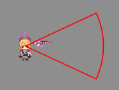

@[TOC] cocos-绘制图形、绘制辅助线

# 绘制图形、绘制辅助线

记录自己使用cocos的学习历程

参考 https://blog.csdn.net/qq_24726043/article/details/133107699

## 目标：用于辅助观察自定义的攻击范围

cocos2d中使用rigibody2d + collider2d去实现攻击范围时因为没有stay这一种事件状态，不方便制作持续，于是转用直接编写范围去判断

同时使用辅助线去绘制基本的范围

## 组件：Graphics

尝试去绘制一个圆弧，顺序是绘制圆弧，圆弧终点连圆心，圆心连圆弧起点

```typescript
attackDetectionDraw(){
    let playerNode = GameManager.instance().player.node;
    let centerPos = playerNode.position;
    this.atkDetectionNode.setWorldPosition(playerNode.worldPosition);
    const graphics = this.atkDetectionNode.getComponent(Graphics);

    // 初始化一下Graphics的绘制参数
    graphics.strokeColor = Color.RED; // 绘制笔的颜色
    graphics.lineWidth = 5; // 线段粗度
    
    // 计算圆弧的起点
    const angleInRadian = misc.degreesToRadians(this.startAngle);
    const directorVector = v2(Math.cos(angleInRadian), Math.sin(angleInRadian));
    const arcStartPoint = v2(centerPos.x + directorVector.x * this.fanRadius, centerPos.y + directorVector.y * this.fanRadius);

    // 绘制圆弧
    graphics.arc(centerPos.x, centerPos.y, this.fanRadius, misc.degreesToRadians(this.startAngle), misc.degreesToRadians(this.endAngle),true);
    
    // 圆弧终点连接圆心
    graphics.lineTo(centerPos.x, centerPos.y);

    // 圆心连接圆弧起点
    graphics.lineTo(arcStartPoint.x, arcStartPoint.y);

    // 绘制路径
    graphics.stroke();
}
```

效果图



